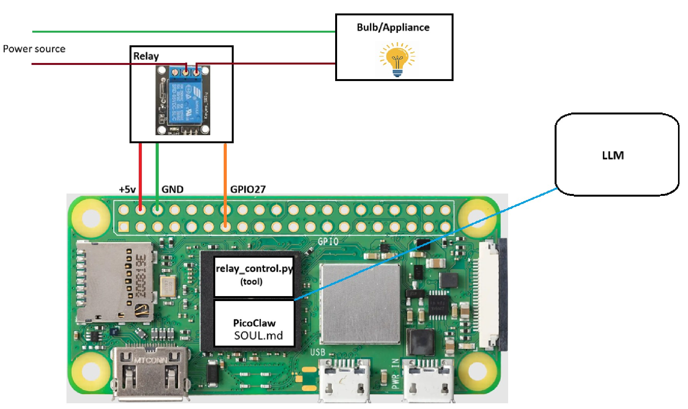

# AI Agent-Controlled Light Switch using PicoClaw and Raspberry Pi Zero 2W
This is a demo project showing how to use PicoClaw AI agent and Raspberry Pi Zero 2W to control home appliances using natural languag
e


## Requirements
- [Raspberry Pi Zero 2W](https://www.raspberrypi.com/products/raspberry-pi-zero-2-w/) 
- [PicoClaw AI](https://picoclaw.net/) agent installed and configured on Raspberry Pi Zero 2W. Pease refer to my Medium article for detailed documentation of how to set up and configure PicoClaw on Rasperry Pi Zero 2W: [AI Agent-Controlled Light Switch using PicoClaw and Raspberry Pi Zero 2W](https://medium.com/@yourusername/ai-agent-controlled-light-switch-using-picoclaw-and-raspberry-pi-zero-2w-1234567890)
- 5V Electromagnetic relay module and jumper wires
- Python 3.7 or higher (pre-installed on Raspberry Pi OS)
- Additional packages (if not already installed):
    ```bash
    sudo apt update
    sudo apt install -y python3-venv python3-pip
    sudo apt install python3-dev python3-pip build-essential
    sudo apt install python3-rpi.gpio
    ```


## Usage
- Clone this repository to your Raspberry Pi Zero 2W to path ```~/git/picoclaw-ai-switch```
- Update PicoClaw's workspace path to point to the cloned repository path. You can do this by adding the following lines to your PicoClaw configuration file (```~/.picoclaw/config.yaml```):
    ```yaml
    {
        agents: {
            "defaults": {
                workspace: "~/git/picoclaw-ai-switch",
                "restrict_to_workspace": true,
                "provider": "gemini",
                "model": "gemini-2.5-flash",
                "max_tokens": 8012,
                "temperature": 0.7,
                "max_tool_iterations": 20,
            }
        }
    }
    ```
- From within the project directory, create a Python virtual environment and install the required dependencies:
    ```bash
    cd ~/git/picoclaw-ai-switch
    python3 -m venv venv
    source venv/bin/activate
    pip install -r requirements.txt
    ```
- Connect the relay module to the Raspberry Pi GPIO pins and the light switch according to the wiring diagram provided in the image below:

- Before running running the AI agent, make sure to test the relay control script manually to ensure that it can successfully turn the light on and off:
    ```bash
    python3 relay_control.py on
    python3 relay_control.py off
    ```
    This should print messages confirming that the relay has been turned on and off, and you should see the relay respond (latch/unlatch) accordingly.

- Now you can start the PicoClaw AI agent and interact with it using natural language commands to control the porch light. To start the conversation, simply run the PicoClaw agent command:
    ```
    picoclaw agent
    ```
    Then you can ask the AI agent to turn on/off the porch light using commands like "Turn on the porch light", "Turn off my porch light", etc. The AI agent will respond by executing the appropriate relay control commands and providing feedback on the actions taken.
    ```
  - If you want to add more constraints and/or features such as time-based actions (e.g., "turn off the porch light if it is daytime"), you can modify the `SOUL.md` file to include additional commands and logic for handling these scenarios. Make sure to implement the necessary functions in the `relay_control.py` script to support these features.   
